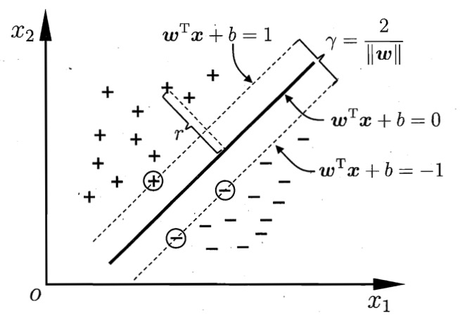

## 间隔与支持向量

在样本空间中，划分超平面可通过线性方程描述：

$$ {{\omega}^{T}}x + b = 0 $$

其中\\(w=(w\_1,w\_2,...,w\_d)\\)为法向量，决定超平面的方向。\\(b\\)为位移量，决定超平面与原点之间的距离。将超平面记为\\((w,b)\\)。

样本空间中任意点\\(x\\)到超平面\\((w,b)\\)的距离可写为：

$$ r=\frac{|{w}^{T}x+b|}{||w||} $$

若\\({{\omega}^{T}}x + b>0, y\_i=+1\\)；\\({{\omega}^{T}}x+b<0, y\_i=-1\\)。令：

\begin{cases} {w}^{T}x+b\ge +1, y\_i=+1\\\ \\\ {w}^{T}x+b \le-1, y\_i=-1 \end{cases}

如图所示：

<label style="font-size: 12px">图 支持向量与间隔</label>

距离超平面最近的几个训练样本点被称为“支持向量”，两个异类支持向量到超平面的距离之和为间隔：

$$ \gamma=\frac{2}{||w||} $$

目标：找到\\((w, b)\\)使间隔\\(\gamma\\)最大。等价于：

$$ \underset{w,b}{min} \frac{1}{2}{||w||}^{2} \tag{0}$$

$$ s.t. ({w}^{T}x+b)y\_i \ge 1, i=1,2,...,m $$

## 对偶问题

对上式使用拉格朗日乘子法可得到其对偶问题：

$$ L(w,b,\alpha)=\frac{1}{2}{||w||}^{2}+\sum\_{i=1}^{m}{\alpha\_i(1-({w}^{T}x+b)y\_i)} \tag{1}$$

令\\(L(w,b,\alpha)\\)对\\(w\\)和\\(b\\)的偏导为零得：

$$ w=\sum\_{i=1}^{m}{\alpha\_iy\_ix\_i} \tag{2}$$

$$ 0=\sum\_{i=1}^{m}{\alpha\_iy\_i} \tag{3} $$

将(2)代入(1)并考虑(3)的约束，得到(0)的对偶问题：

$$ \underset{\alpha}{max}\sum\_{i=1}^{m}{\alpha\_i}-\frac{1}{2}\sum\_{i=1}^{m}\sum\_{j=1}^{m}{\alpha\_i\alpha\_jy\_iy\_j{x\_i}^{T}x\_j} \tag{4}$$

$$ s.t. \sum\_{i=1}^{m}{\alpha\_iy\_i}=0 $$

$$ \alpha\_i\ge 0, i=1,2,...,m $$

于是解出\\(\alpha\\)后，求出\\(w\\)与\\(b\\)即可得到划分超平面的模型：

$$ a $$

